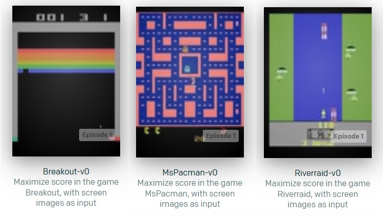
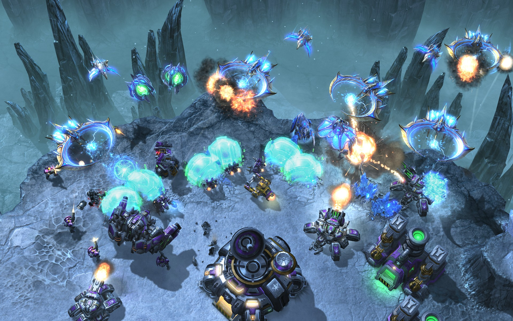
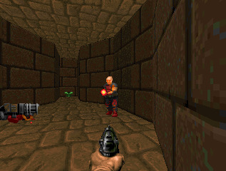
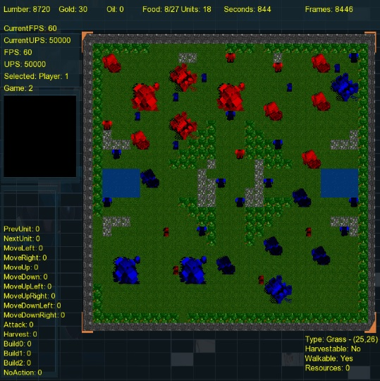

# URNAI-Tools
URNAI Tools is a modular Deep Reinforcement Learning (DRL) toolkit that supports multiple environments, such as [PySC2](https://github.com/deepmind/pysc2), [OpenAI Gym](https://github.com/openai/gym), [ViZDoom](https://github.com/mwydmuch/ViZDoom) and [DeepRTS](https://github.com/cair/deep-rts). The main goal of URNAI Tools is to provide an easy-to-use modular platform for the development of DRL agents. Each part of a typical Reinforcement Learning scenario, such as the environment, the learning algorithm, the action space and so on, is considered a module in URNAI and can be easily swaped. Beyond that, it supplies a series of out-of-the-box DRL algorithms, environment wrappers, action wrappers, reward functions and state representations, allowing developers to easily assemble different learning configurations and quickly iterate through them.

## Getting Started

We have created a few files called "solve" files, in each of which we create basic reinforcement learning experiments for a specific game and a specific RL algorithm.

In these files we instantiate all base objects necessary to use URNAI to train a RL Agent. This is one of the most simple and intuitive ways of using URNAI, and we recommend that, after installation, new users take a look at our [solve files](./urnai/solves) to start their own experiments.

### Prerequisites

- Python 3.6
- Python 3 PIP

### Installation

There are two main ways of installing URNAI. The first one would be to clone this repository to your local machine, and run python files directly. The second one would be to install this repository as a Python package using pip. 

The second option allows you to use URNAI on your command line as a python package, and schedule batches of trainings using .CSV or .JSON files easily. However, it can make experimentation cumbersome, as our solve files are not installed by default, and to create new solve files one would have to code directly in the installation path for python packages, which is not very intuitive. 

Therefore, if you intend to use URNAI on the command line but also want to develop in it (modify or create new experiments and classes), we recommend you do both of these installations:

- Cloning this repo:
```
git clone https://github.com/marcocspc/URNAI-Tools.git
```
You can clone this repo to any folder you desire, and use it to run solve files or even modify the toolkit as you wish.

- Install urnai Python package from this repo:
```
pip3 install git+https://github.com/marcocspc/URNAI-Tools/
```

Installing using pip will automatically install URNAI dependencies, such as PySC2, Tensorflow, Keras, Gym etc. To see all dependencies you can check [setup.py](https://github.com/marcocspc/URNAI-Tools/blob/master/setup.py). 

**By default, URNAI installs tensorflow-gpu**. If you wish to install tensorflow-cpu instead, check out [this section](#tensorflow-cpu).

If you opt to install URNAI by only cloning this repo (without pip), you will need to manually install all dependencies to use the toolkit.

### Supported Environments

Installing URNAI as a python package will also install all basic required game environments, including OpenAI Gym, and PySC2. But for other supported environments, you will need to install them for yourself. We give a brief overview of each environment and its installation bellow. 

We would also like to highlight that the environment wrapper, action wrapper and reward builder classes available in URNAI are inspired by Gym's wrappers, and are made to fit over them. Therefore, developers used to Gym's naming conventions and their way of representing states, rewards and action sets, will find URNAI to be comfortably familiar. Consequently, the addition of new Gym-like game environments to URNAI should be an easy task for any developer that is relatively familiar with Gym's workflow.

#### OpenAI Gym




[Gym](https://gym.openai.com/) is already marked as a dependency, so it will be automatically installed by pip. Gym is a widely known and used Reinforcement Learning toolkit that provides a series of ready-to-use standardized environments. A few Gym sub packages don't come with the main package, and need to be installed separetly. That's the case with Gym Atari games. To see a quick installation guide for Gym Atari [click here](#gym-atari-games) 

#### Starcraft II



PySC2 is already marked as a dependency, so it will be automatically installed by pip. However, you need to install StarCraft II and download some of its available maps (mini-game, testing and full-game maps) in order to use this environment in URNAI. To do this, you can head to PySC2's tutorial:

[How to install Starcraft II and Maps](https://github.com/deepmind/pysc2#get-starcraft-ii) 

We would recommend you install atleast the Melee maps, as those are used in some of our solve files for StarCraft II.

#### VizDoom



Installation of VizDoom for Python is not as straight forward as some other packages, as you need a few dependencies, and installation process might vary depending on whether you're on Linux, MacOS or Windows. We recommend you check their [installation/building guide](https://github.com/mwydmuch/ViZDoom/blob/master/doc/Building.md) for a full explanation.

#### DeepRTS 



URNAI supports a modified [DeepRTS](https://github.com/cair/deep-rts) version. To download it as a python package, run the following command:

```
pip3 install git+https://github.com/marcocspc/deep-rts
```

#### Gym Atari Games

Gym doesn't come with Atari games by default. To use them, a Gym subpackage needs to be installed:

- On Unix:
```
pip3 install gym[atari]
```

- On Windows:

Unfortunately, this package tends to have problems when installed on a Windows system. A workaround can be found in this unofficial [atari-py](https://github.com/Kojoley/atari-py) repository.

### Optional Configurations

#### Tensorflow CPU

By default, URNAI depends on tensorflow-gpu, to use tf-cpu instead, use:

- On Unix:
```
URNAI_TF_CPU=1 pip3 install git+https://github.com/marcocspc/URNAI-Tools/ 
```

- On Windows:
```
set "URNAI_TF_CPU=1" && pip3 install git+https://github.com/marcocspc/URNAI-Tools/
```

#### Latest Dependencies 

By default, URNAI fixes all dependencies' versions. If you need to install those dependencies in theirs latest versions, use: 

- On Unix:
```
URNAI_LATEST_DEPS=1 pip3 install git+https://github.com/marcocspc/URNAI-Tools/
```

- On Windows:
```
set "URNAI_LATEST_DEPS=1" && pip3 install git+https://github.com/marcocspc/URNAI-Tools/
```

### Running the examples

From version 0.0.2+ you can use CSV or JSON files to run a batch of trainings:

```
git clone https://github.com/marcocspc/URNAI-Tools 
cd 'URNAI-Tools/urnai/solves'
urnai train --train-file=solve_x.json
```
or
```
urnai train --train-file=solve_x.csv
```

The Alternative to using JSON files is to run one of our solve_x.py files in your Python interpreter. These files are used to instantiate and train an AI agent.
There are a few files to choose from. To see the solve files for games and scenarios that we have already solved (achieved a reasonable level of success) check the [solves directory](./urnai/solves). To see the solve files that are currently being worked on, and that we haven't yet found a successful solving strategy, check out the [solves/experiments directory](./urnai/solves/experiments).

These Solve files are great learning tools to get in touch with URNAI's architecture because they instantiate every object that needs to exist in order for the training of an Agent to occur. They start from the very basic instantiation of an environment, to the more complex instantiation of a Learning Model, with its layers and hyperparameters. At the end, all of those instantiated objects are used by the Trainer class, responsible for implementing the Reinforcement Learning cycle.

## Command line

If you installed URNAI as a python package using pip, you can use it on the command line.

To see what you can do, run:
```
urnai -h
```

## Building your own code

URNAI was created to allow easy iteration of code, so that developers can quickly do changes to the modules they need, without having to worry about other modules, as those are already ready to use.

In this sense, the development of a new feature that fits your needs will probably consist of creating new classes that inherit from URNAI's, and then building from there, with the implementation of the necessary methods.

Below we give a brief overview of some of URNAI modules, such as the Agent, the Model, and the Environment modules. Beyond that, you can take a look at a full overview of URNAI's architecture [here](./docs/diagrams/arch.png).

### Building a new agent for a supported environment

To understand what the Agent class is and how to build new Agent classes check out the readme in the [urnai.agents](./urnai/agents) module.

But, despite what the naming might suggest, building a RL Agent is not acomplished completely by just creating (or using) a new Agent class. An agent also needs an action set, a reward function and a state representation.

To create new Action Wrappers, Reward Builders and State Builders you should check the following readmes:

- [urnai.agents.actions](./urnai/agents/actions)

- [urnai.agents.rewards](./urnai/agents/rewards)

- [urnai.agents.states](./urnai/agents/states)

### Building a new DRL model

To build a new reinforcement learning model, you should check the readme in the [urnai.models](./urnai/models) module.

### Integrating a new environment

To integrate a new environment, you might want to check the readme in the [urnai.envs](./urnai/envs) module.

## Built-in Persistence

URNAI has a built-in persistance module, that saves the training progress of Reinforcement Learning Agents, saving both the internal Neural Network parameters aswell as the Python parameters used during training, guaranteeing that when you load the training it will execute as intended.

This persistante module is supported by our [Savable class](./urnai/base/savable.py), that serves as a base class for pretty much all classes in URNAI, since we want to save a "snapshot" of almost every class during training. 

Savable utilizes a Python package called [Pickle](https://docs.python.org/3/library/pickle.html), that serializes every Python attribute that can be serialized and then stores them in a file. Pickle is then able to later de-serialize these files and restore our classes and Objects to the state they were right when training was saved, allowing us to easily pause / resume trainings without any manual work. 

In summary, all you need to do to use the Built-in Persistance Module is to set "enable_save=True" when you initialize our [Trainer class](./urnai/trainers/trainer.py). The Trainer will then automatically save / load the training whenever its conditions are met (load when a training already exists, save at the ending, save every X episodes, etc).

Another feature that needed to be implemented to allow more flexibility for end users was the **Pickle Black List**. This is basically an attribute of the Savable class that stores the names of all variables that we wish to ignore in the saving/loading process. 

So, for example, if you have created a new trainer class, or overriden URNAI's base trainer, you could change the self.pickle_black_list attribute to not save the total amount of trained episodes, so that every time you restart the training your agent will always train max_training_episodes .

## Roadmap

Here you'll find all the things that we plan to do in this project. **Bold** items are work in progress.

* [ ] Documentation
  * [ ] **Core codebase documentation/commenting**
  * [ ] **Documentation for each of the main modules (env, agents, models etc)**
  * [ ] **Statistics for solved problems**
* [X] Support for new environments
  * [X] [Arcade Learning Environment](https://github.com/mgbellemare/Arcade-Learning-Environment) ([atari-py](https://github.com/openai/atari-py))
  * [X] [Vizdoom](https://github.com/mwydmuch/ViZDoom)
  * [X] [DeepRTS](https://github.com/cair/deep-rts)
* [ ] More Deep RL algorithms
  * [X] Deep Q-Learning
  * [X] Policy Gradient
  * [X] Double Deep Q-Learning
  * [ ] A3C
  * [ ] Curiosity-Driven Learning
  * [ ] Proximal Policy Optimization
* [X] Core codebase improvements
  * [X] Logger class
  * [X] Save model parameters
  * [X] Persistance of training parameters (saving / loading)
  * [X] Automatic generation of training graphs (avg. reward, avg. win rate etc.)
  * [X] Improvement of Model/Algorithm architecture to allow more modularity, dubbed version 1.0
* [ ] Solve more problems
  * [X] Frozenlake
  * [X] Cartpole-V0
  * [X] Cartpole-V1
  * [X] StarCraft II - Simple 64 Map - Very Easy difficulty
  * [ ] **StarCraft II - Simple 64 Map - Easy Difficulty**


## Authors

* **Francisco de Paiva Marques Netto** - *Initial work* - [pvnetto](https://github.com/pvnetto)
* **Luiz Paulo de Carvalho Alves** - *Integration and experimentation with StarCraft II - Rollout of 1.0 Architecture* - [lpdcalves](https://github.com/lpdcalves)
