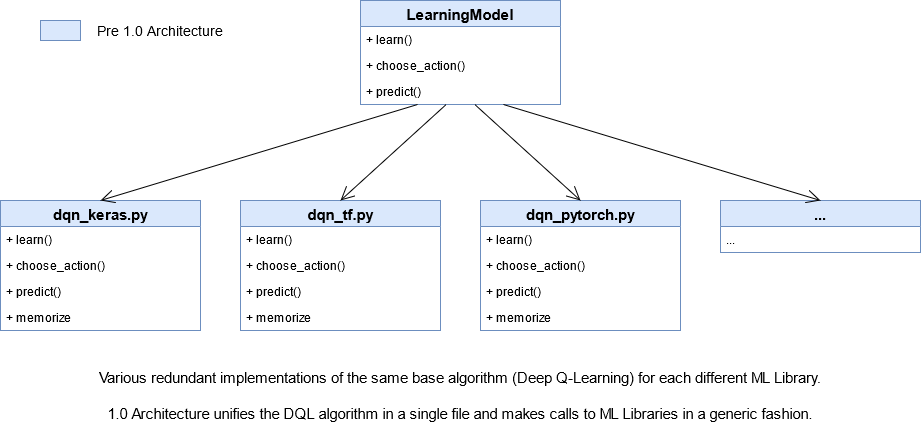
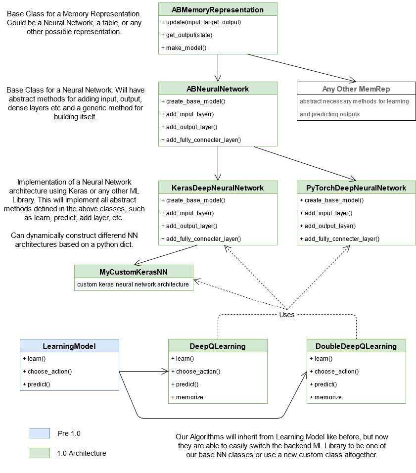

# Models

Models are a generalized AI term used to reference both Neural Networks and the Machine Learning Algorithms used to train them. It is inside a Model where we define methods that allow a Neural Network to construct its own architecture using a Machine Learning Library, to learn using information from the environment and its reward function and to select an optimal action for a certain situation.

Models are often implemented with the Algorith and the Neural Network being intertwined together in one file, and that is how URNAI used to implement Models up until version 1.0. These legacy URNAI Models can be seen in this directory, on files such as [ddqn_keras.py](./ddqn_keras.py) or [dqn_keras.py](./dqn_keras.py), and are fairly straightforward for anyone that has implemented a Reinforcement Learning Algorithm before.

From version 1.0 onwards URNAI supports the separation of Neural Networks and ML Algorithms, so you can create a Deep Q-Learning Algorithm, for example, and couple it with any Neural Network architecture you desire. Due to this separation, the same Algorithm can be used with different ML libraries as a back end, enabling you to run experiments with the exact same algorithm in Keras and then on PyTorch by simply changing a parameter, without having to manually change the Library calls throughout the entire code, as those are handled generically by URNAI.

Our Neural Network classes are stored on [memory_representations/neural_network](./memory_representations/neural_network). To understand our naming convention of what is a memory representation, and to understand our base Neural Network classes we recommend you read the description of our [ABMemoryRepresentation](./memory_representations/base/abmem.py), [ABNeuralNetwork](./memory_representations/neural_network/abneuralnetwork.py) and [KerasDeepNeuralNetwork](./memory_representations/neural_network/keras.py) classes in their python files.

The Machine Learning Algorithms implemented by default in URNAI are stored on [algorithms](./algorithms), and their usage is exactly the same of any model from before 1.0 version, making both ways of creating models compatible.

The following images compare pre 1.0 and 1.0 architecture, making it a bit easier to visualize the changes, and how the 1.0 architecture facilitates modularity and flexibility for model creation.

#### Pre 1.0:

#### 1.0:

The 1.0 URNAI architecture was created with the goal of allowing both advanced machine learning researchers and newcomers to the field the ability of quickly creating and testing their desired model architectures. 

If you're a newcomer, or if you just want to get the hang of URNAI without going too deep into model building, you can start
by using an algorithm directly (DeepQLearning, DoubleDeepQLearning, etc). To do that, you simply have to use the [ModelBuilder class](model_builder.py) to dynamically construct a NN architecture and pass that to your algorithm. Examples of this can be seen on our solve files, but basically you instantiate a ModelBuilder object, add layers (input, dense, output) and then pass the python dict of the ModelBuilder object to your algorithm through the "build_model" atribute. In this way, you can easily specify the size of your input, fully connected and output layers, without having to worry about implementation details.

If you have more knowledge on AI and Reinforcement Learning, you might want to start your model building by creating a new class that inherits from either KerasDeepNeuralNetwork or PyTorchDeepNeuralNetwork. You can find an example of how to do that in our [DNNCustomModelOverrideExample class](./memory_representations/neural_network/keras.py). If you want even more flexibility, and less overhead from our base Keras/PyTorch classes, you can inherit directly from [ABNeuralNetwork](./memory_representations/neural_network/abneuralnetwork.py) or even [ABMemoryRepresentation](./memory_representations/base/abmem.py), just make sure to implement all necessary abstract methods, so that your custom class fits over URNAI's architecture, making it usable by the training module.

# Adding a new Model

Adding new Models is fairly simple:

## Old Way
If you want to do it with pre 1.0 architecture, just create a new class that inherits from [LearningModel](./base/abmodel.py) and code in there both your algorithm and the neural network and its calls to your prefered Machine Learning Library. I'll need to implement all necessary methods, such as learn, predict, save_extra, etc. An example of a pre 1.0 implementation can be seen in our [dqn_keras.py file](./dqn_keras.py).

## New Way
If you want to use the new architecture, you have a couple of different options:

- ### Adding a new Algorithm
    If you're trying to implement a new RL algorithm (A3C, DDPG, or any other) you just need to create a new class that inherits from [LearningModel](./base/abmodel.py), implement your algorithm in there, and whenever you want to make the NN learn, predict etc you can just use generic calls to the Neural Network's class, allowing you to use any Model architecture or ML Library you desire as a back end to this new algorithm. Examples on how to do this can be seen in our [DeepQLearning algorithm](./algorithms/dql.py) or our [DoubleDeepQLearning algorithm](./algorithms/ddql.py).

- ### Adding a new Memory Representation
    - If you're interested in creating a new Neural Network architecture you can do that by inheriting from either KerasDeepNeuralNetwork or PyTorchDeepNeuralNetwork and then build a custom "make_model( )" method, such as in [DNNCustomModelOverrideExample](./memory_representations/neural_network/keras.py).
    
    - If you want to add support for a new ML Library other than Keras or PyTorch, you can inherit from [ABNeuralNetwork](./memory_representations/neural_network/abneuralnetwork.py) and add your library-specific calls in your new class.
    
    - If you want to experiment with a new type of memory representation, you can inherit from [ABMemoryRepresentation](./memory_representations/base/abmem.py), and implement how your MemRep will learn, predict actions and create its architecture.